<div align="center">

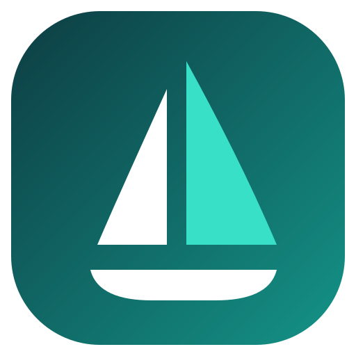

# Vela Maps

**The best of OpenStreetMap and Google Maps, in one app.**

Live traffic, real place data and turn-by-turn navigation, with no Google account, no Play Services and no Google code on your phone.

[](https://github.com/PimpinPumpkin/Vela/releases/latest)
[](https://github.com/PimpinPumpkin/Vela/actions/workflows/ci.yml)
[](LICENSE)
[](https://github.com/PimpinPumpkin/Vela/stargazers)
[](https://hosted.weblate.org/engage/vela-maps/)

[Install](#install) · [What you get](#what-you-get) · [Docs](https://pimpinpumpkin.github.io/Vela/docs/) · [FAQ](docs/FAQ.md) · [The book](docs/book/README.md) · [Privacy](#privacy) · [How it works](SPEC.md) · [Build](docs/BUILDING.md) · [Discussions](https://github.com/PimpinPumpkin/Vela/discussions) · [Translate](https://hosted.weblate.org/engage/vela-maps/)

[](https://pimpinpumpkin.github.io/Vela/)

</div>

> [!warning]
> **Vela is in beta, so you may run into bugs.** If you do, open an issue and fill out the
> template. Nightlies and canary builds are newer still and less tested than the weekly stable.

An open-source Google Maps alternative for Android: *what NewPipe is to
YouTube, for Google Maps.* The map is open data. The basemap is open vector tiles, and
the places on it are **Vela data**: Overture Maps and AllThePlaces, positioned
with OpenStreetMap, baked into tiles in this repo and streamed from its
releases. Browsing around never asks Google anything. Search, tap a place or
ask for a route, and the phone itself asks Google's public web endpoints, with
no account, no key and no server in between, for what only Google does well:
search, hours, reviews, photos, and routes that know about traffic and closed
roads. Built for degoogled phones such as GrapheneOS, and it runs on stock
Android too.

<p align="center">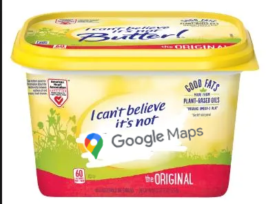</p>

## What reaches Google, by default

**It is not a Google Maps wrapper.** Vela is a native Android app drawing open vector tiles
(Jetpack Compose and MapLibre). There is no Google SDK in it, no Play Services, no API key and
nothing to sign in to. It looks like Google Maps on purpose.

| What you do | What reaches Google |
| --- | --- |
| Pan, zoom, browse the map | **Nothing.** Tiles from OpenFreeMap, streets and labels from OpenStreetMap |
| The places drawn on the map | **Nothing, where Vela has place data.** Open data baked in this repo: Overture Maps and AllThePlaces, positioned with OpenStreetMap. Where Vela has none for the area on screen, Google's places are drawn and Google is sent that area |
| Drop a pin, tap a house number | **Nothing.** OpenStreetMap's Nominatim names the spot |
| Read a departure board | **Nothing, for the stops Vela draws from open transit data:** the board comes from Transitous. Where Transitous has no coverage, Vela falls back to the stop's Google page |
| Ask for directions | **Where the trip starts and ends, anonymously.** A driving route is Google's own, so it knows about traffic and closed roads. The turn-by-turn instructions are put on it from OpenStreetMap, by the open OSRM and Valhalla routers, which are sent the same trip. While you drive, Google is asked again when you leave the route and every couple of minutes for traffic; Settings → Navigation turns the second off. Walking and cycling routes come from the open routers (for a walk Google is asked once, and its route used only when it is much shorter). Offline, the route is computed on the phone |
| Type a search | **Your text, anonymously**, like a logged-out browser. Typing sends Google's own autocomplete each time you pause; submitting sends a Google search. Text that starts with a house number also goes to the open Photon geocoder |
| Tap a place | **An anonymous lookup of that place**, with no account and no app key, for its hours, reviews and photos. Settings → Places can stop the lookup for places tapped on the map |
| Everything you save | **Nothing, ever.** No account, no Vela backend, no Vela telemetry; saved places, history and settings stay on the phone |

Download a region and the map, search, routing and turn-by-turn navigation work with no
network. Offline, or with **Settings → Privacy → Use Vela without Google** on, nothing reaches
Google at all. The first run asks which you want, before the map loads. A few things Google only serves to a real browser, a place's reviews among them,
are read from a Google page in an offscreen WebView, anonymously; the list is in
[PRIVACY.md](PRIVACY.md#the-hidden-pages).

**[The full comparison against the Google Maps app and Google Maps web is below](#privacy)**, and
the per-request detail is in [PRIVACY.md](PRIVACY.md).

## Screenshots

| Navigation | Map & search | Place details | Directions | Search results |
|:-:|:-:|:-:|:-:|:-:|
| 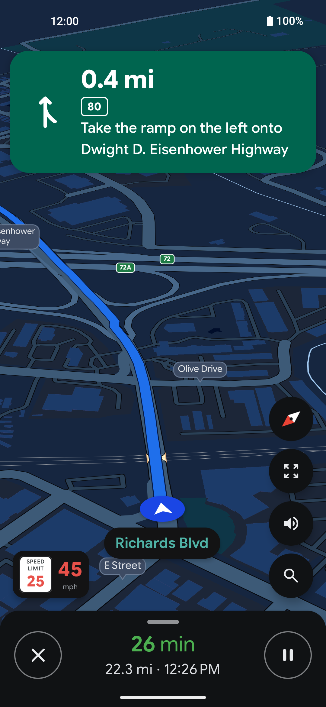 | 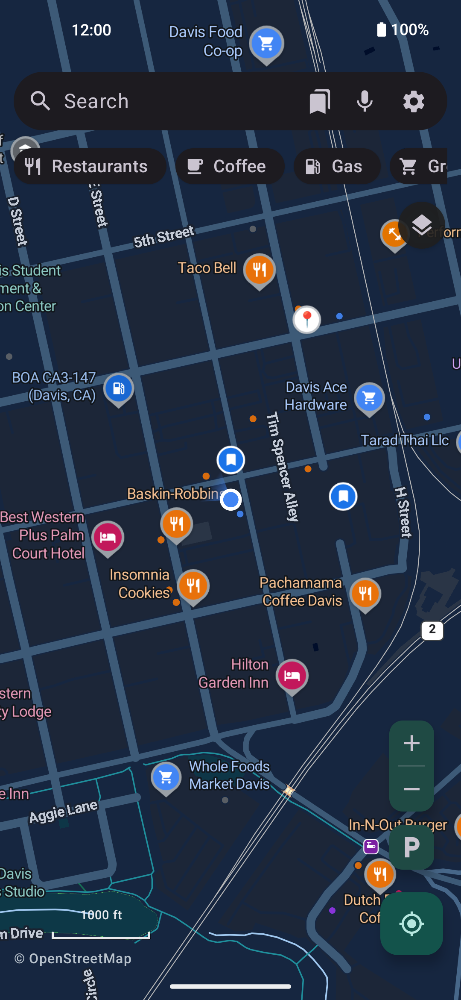 | 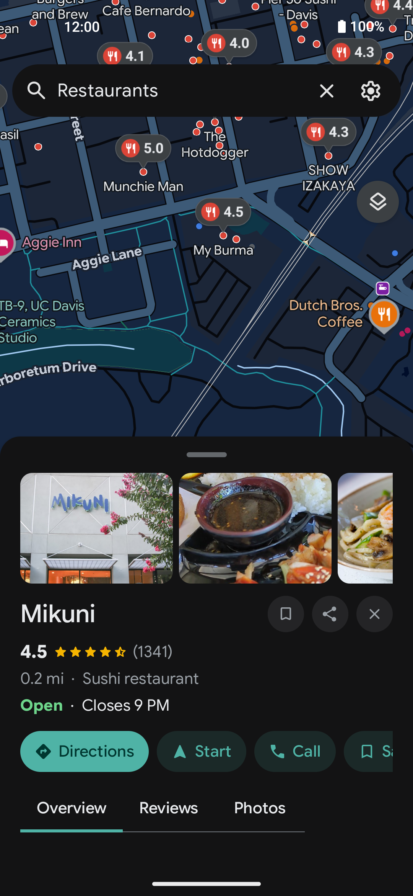 | 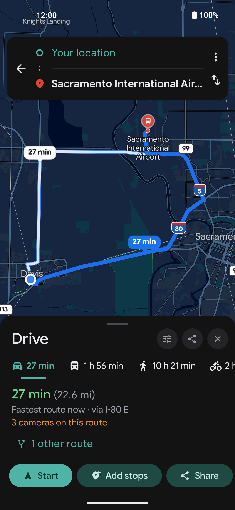 | 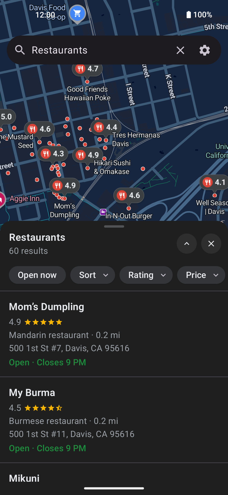 |

| Public transit | Departure board | Stops on the line | Light theme - map | Light theme - place |
|:-:|:-:|:-:|:-:|:-:|
| 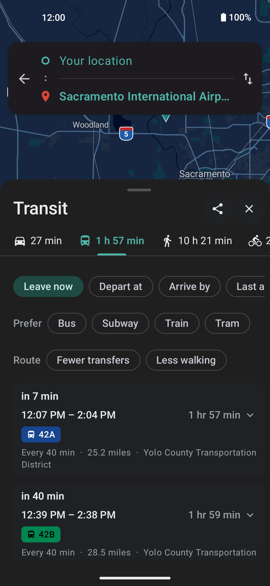 | 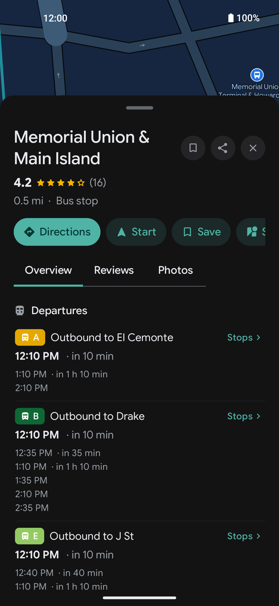 | 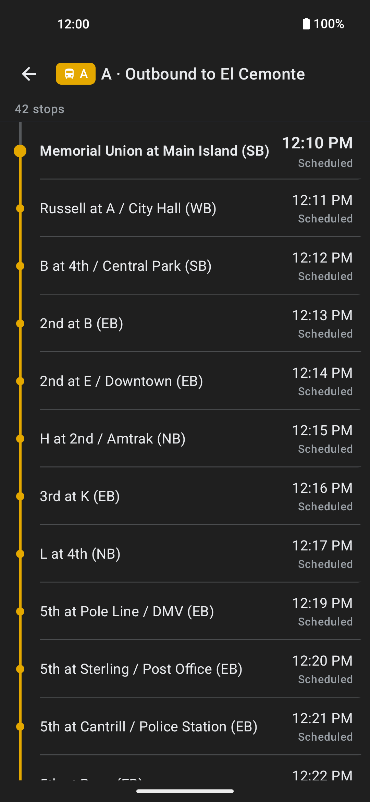 | 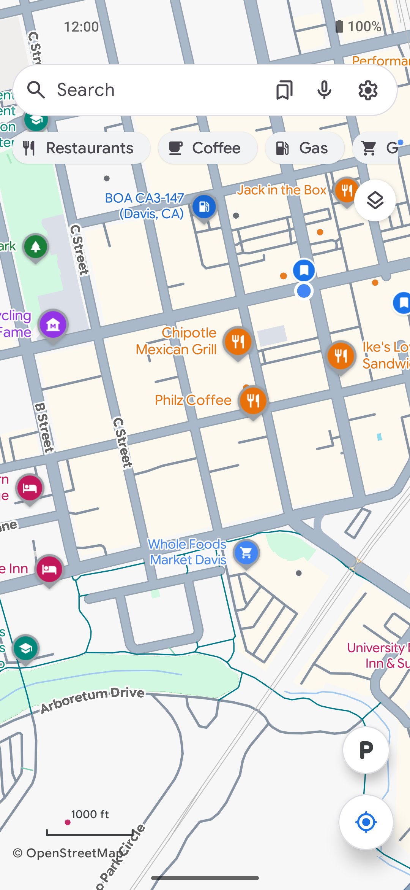 | 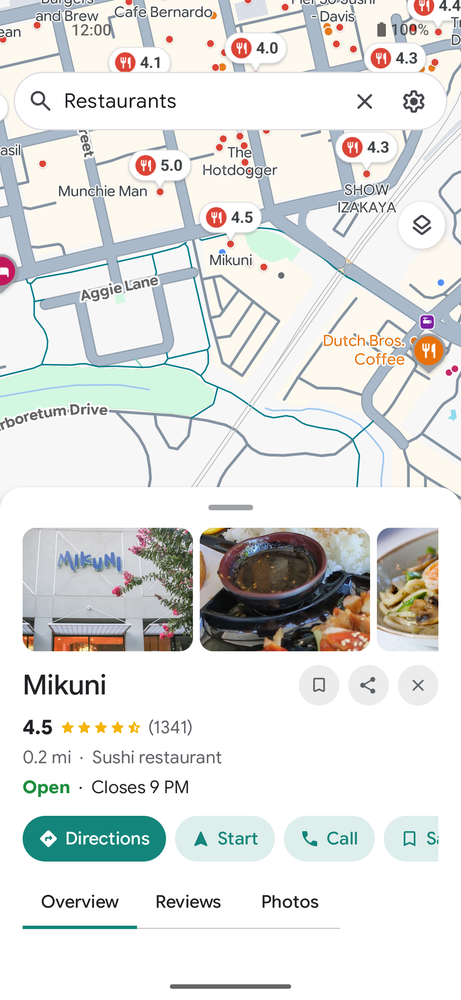 |

*Turn-by-turn with lane guidance, route shields and the speedometer. The OpenFreeMap
basemap in Google's colors with Google Sans Flex labels. Place pages with live data. The
route picker with alternates, traffic and the avoid switches. Live departure boards with
the stop list for every route. Light and dark themes, set in the app.*

## Install

[](https://apps.obtainium.imranr.dev/redirect?r=obtainium://add/https://github.com/PimpinPumpkin/Vela)&nbsp;&nbsp;[](FDROID.md)

Obtainium tracks the **weekly stable** release. Turn on "include prereleases" for
the **nightly** channel.

The F-Droid badge is **Vela's own repository**, not the f-droid.org catalog. Add
`https://pimpinpumpkin.github.io/Vela/repo` to any F-Droid client and it serves
the same signed APKs, weekly stable by default (fingerprint and nightly setup in
[FDROID.md](FDROID.md)). Or take an APK straight from
[Releases](https://github.com/PimpinPumpkin/Vela/releases).

### Check you got the real thing

Every Vela APK, from any channel, is signed with the same key. Its certificate
fingerprint is:

```
SHA-256  29:93:8B:48:58:06:3E:42:E6:77:FF:95:C9:01:CD:48:24:8A:7F:03:2A:3A:E8:5F:9B:9E:56:17:56:8B:0D:36
```

Check a downloaded file against it before installing:

```bash
apksigner verify --print-certs vela-maps-*.apk
```

On the phone, [App Verifier](https://github.com/soupslurpr/AppVerifier) checks
the same thing. It wants the package name on the first line and the fingerprint
on the second, so paste this block, not the line above:

```
app.vela
29:93:8B:48:58:06:3E:42:E6:77:FF:95:C9:01:CD:48:24:8A:7F:03:2A:3A:E8:5F:9B:9E:56:17:56:8B:0D:36
```

Android enforces this for you after the first install: an update signed with a
different key is refused, so a build that installs over your existing Vela came
from the same place this one did.

This is the certificate the app is signed with, and it stays the same across
releases. It is not a checksum of a particular APK, and it is not the same as
the F-Droid repo fingerprint in [FDROID.md](FDROID.md), which signs the repo
index rather than the app.

There is a one-page tour at
**[pimpinpumpkin.github.io/Vela](https://pimpinpumpkin.github.io/Vela/)**, and the docs in this
repository are published as a searchable site at
**[pimpinpumpkin.github.io/Vela/docs](https://pimpinpumpkin.github.io/Vela/docs/)**.

[](https://buymeacoffee.com/PimpinPumpkin)

---


## What you get

- **Routes and traffic from Google.** A driving route is the one Google would give
  you, with live traffic and closed roads accounted for. Each option shows its
  time in green, amber or red and says light, moderate or heavy traffic in words.
  Turn-by-turn navigation runs on top: lane diagrams, exit shields, a speedometer
  with the posted limit, and a faster-route offer when a jam builds ahead.
- **The places on the map are open data, and Google fills in the details.** Every
  pin, dot and label you pan past is **Vela data**: Overture Maps and AllThePlaces,
  positioned with OpenStreetMap, baked into map tiles in this repo, streamed from
  its releases and carried offline with a downloaded region. Browsing sends Google
  nothing. Tapping a place asks Google for what open data lacks: hours with
  holidays, reviews you can search, photos, busy times, phone and website, and a
  warning if the place will be closed when you arrive. **Settings → Places →
  "Place icons on the map"** switches the map between Vela data (the default),
  Both, or Google, and a separate switch stops a tapped place from being looked
  up. The [FAQ](docs/FAQ.md) says what each feature uses.
- **No Google software on your phone.** No Play Services, no account, no app key, no ads.
  Google never sees your map browsing or your saved places, and your GPS trail
  stays on the phone. A position reaches Google only in specific requests: a
  route from where you are, a search that ranks nearby places first, and the
  reroute and traffic checks while you navigate. [Privacy](#privacy) has the
  breakdown.
- **Flock cameras on the map.** Mapped license plate cameras (the community
  DeFlock project's OpenStreetMap data) are drawn out of the box. **Avoid
  surveillance cameras**, in Settings → Navigation or the route picker, counts
  the cameras pointed along each route and picks a lower-camera one when the
  detour is small. Two more switches give a card or a spoken "License plate
  camera ahead" as you approach one. The dataset lives on the phone and updates
  weekly.
- **Vela Voice.** Spoken directions from a neural voice that runs on the phone,
  and a mic that transcribes your search on the phone too. Nothing you say goes
  to a speech service.

  🔊 **Hear it**, the in-app voice at its default pace:

  https://github.com/user-attachments/assets/17f246e4-51c8-4d01-998b-dcd7f29dc15f

- **Offline maps and routing.** Download a state or a country, or just the area
  on screen, and its map, its places, typed street addresses and turn-by-turn
  routing work with no signal.
- **Public transit.** Departure boards and the stop list of every run come from
  the open timetables transit agencies publish (served by the community
  Transitous project). Transit directions come from Google, with the open
  planner as the fallback. Rail lines draw in their own colors, and a trip draws
  along its real track.
- **Gas prices.** Search for gas and each station's price is on its marker, in
  the list and on its page.
- **Street View** in the app: look around, walk the street, go back to older
  captures, half screen over the map or full screen.
- **Satellite imagery** from Esri.
- **Lists and saved routes.** Keep places in lists with a note each, save a route
  you like, pin a trip to the home screen, and back all of it up to a file.
  Paste a shared Google Maps list or a My Maps link into the search bar to
  import it.
- **Parking.** Tap **P** when you park, tap the pin later for the walk back.
- **Say it or type it.** "Take me home", "navigate to the station", "Davis to San
  Francisco", "nearest pharmacy", "what's my ETA": the search box treats those as
  actions, spoken or typed, in every language the app speaks.
- **It repairs itself when Google moves things.** The request recipes live in a
  signed file the app checks at launch. When Google shifts a field, a fix reaches
  every install in minutes with no app update. [`SPEC.md`](SPEC.md) sections 3
  and 11 describe it.
- **The rest.** 18 languages, light and dark themes, optional wallpaper colors,
  full operation by D-pad on keypad phones, a built-in updater with stable,
  nightly and canary channels, and Android Auto screens (a car accepts a
  sideloaded app only in some setups; see [docs/ANDROID-AUTO.md](docs/ANDROID-AUTO.md)).

The whole list is in [FEATURES.md](FEATURES.md).

## Why Vela talks to Google at all

A phone without Google Play Services cannot run Google Maps, and the open map
datasets fall well short on search, reviews, hours and live traffic. So for those,
Vela is a client of Google's public web endpoints. It asks them the way a
logged-out browser does, from each user's own phone, with no account, no shared
API key and no server in the middle. NewPipe does the same for YouTube. There are
no ads, and your search history, saved places and settings stay on the phone.

The map, the streets, the labels and the house numbers come from OpenStreetMap
(in much of the US the house numbers come from OpenAddresses). The businesses on
the map come from Overture and AllThePlaces. Google is used for search, place
details, driving routes and traffic, plus things you open yourself such as Street
View and transit directions. So street names and house numbers can differ from
what Google Maps shows, and how much you see offline depends on how well
OpenStreetMap covers your area. I'm thinking of ways to improve OSM and fill the
gaps in the data. Stay tuned.

## Privacy

There is **no Vela backend, no account and no Vela telemetry**. Vela fetches from
Google directly from your phone like a logged-out browser. Google sees your IP,
your query and the map area, but **not a Google account or any app key**, much
like `google.com/maps` in an incognito window. Google does keep its own
logged-out session cookie; Vela starts a new one every week by default
(**Settings → Privacy → Google session**: weekly, daily, or every launch, plus a
button to start one now). Your saved places, history and settings never leave the
device. **[What each service receives is in `PRIVACY.md`](PRIVACY.md).**

In short, Google goes from knowing who you are and everywhere you go to answering
anonymous questions now and then. With the default place source your map browsing
never reaches Google, and your GPS trace is never uploaded anywhere. While you
navigate, Vela asks Google for fresh traffic from your current position every
couple of minutes, which is what powers the faster-route offers and the live
arrival time. **Settings → Navigation → "Live traffic re-checks while
navigating"** turns that off. Reroutes when you leave the route stay, because
turn-by-turn cannot work without them.

| What Google gets | Google Maps app | Google Maps web | Vela |
| --- | --- | --- | --- |
| Tied to your Google account | Yes, always signed in | Yes unless incognito | Never. There is no login |
| A persistent device identifier | Yes (device and ad IDs via Play Services) | Browser cookies | No account, no app key. A logged-out Google session cookie that Vela replaces weekly by default, and an IP like any website visitor |
| Your precise GPS position | Continuously while open, plus Location History if enabled | While the tab is open | Never while browsing. Searches send the map area you are looking at and, to rank nearby places first, can ask about a small area around you. A route from your location sends that point as the start. While navigating, reroutes and the optional traffic re-check send your current position |
| Every pan and zoom of the map | Yes, their servers render the map | Yes | No, by default. Map tiles come from OpenFreeMap and the places on them from Vela's own data |
| Your searches | Yes, saved to your account history | Yes | The text reaches Google anonymously, as you type (autocomplete) and when you search |
| Place pages you open | Yes | Yes | The place lookup reaches Google anonymously, under that logged-out session cookie |
| Turn-by-turn routes | Yes, full trip telemetry | Yes | Google is asked anonymously for the route between two points, and again during the drive for reroutes and the optional traffic re-check. The open OSRM and Valhalla routers get the same trip, to supply the turn instructions. Your GPS trail as a whole never leaves the phone |
| Saved places, home, work | Stored on their servers | Stored on their servers | Stored only on your phone |
| Ad profile building | Feeds your ads profile | Feeds your ads profile | Nothing to attach it to |
| Works with no Google contact at all | No | No | Yes. One switch (Settings → Privacy → Use Vela without Google), and downloaded regions show the map, search, route and navigate offline |

## How it works

[SPEC.md](SPEC.md) is the technical reference: the basemap, the places bake, the
requests to Google, routing, navigation, the offline data and the signed
remote-repair channel. [The book](docs/book/README.md) explains each subsystem in
plainer words.

| File | What's in it |
|---|---|
| [`SPEC.md`](SPEC.md) | Every technical rule, contract and constant |
| [`docs/book/`](docs/book/README.md) | Each subsystem explained: how places rank, when data is rebuilt, how a route is put together |
| [`FEATURES.md`](FEATURES.md) | What the app does, one line each |
| [`PRIVACY.md`](PRIVACY.md) | What each service receives |
| [`docs/FAQ.md`](docs/FAQ.md) | The questions people ask first |
| [`ROADMAP.md`](ROADMAP.md) | What is open. What shipped or was dropped is in [`docs/ROADMAP-HISTORY.md`](docs/ROADMAP-HISTORY.md) |
| [`docs/BUILDING.md`](docs/BUILDING.md) | Building from source |
| [`docs/TRANSLATING.md`](docs/TRANSLATING.md) | The languages, and how to translate (in the browser on [Weblate](https://hosted.weblate.org/engage/vela-maps/)) |
| [`docs/dpad.md`](docs/dpad.md) | Operation without a touchscreen |
| [`CLAUDE.md`](CLAUDE.md) | Rules and traps for anyone changing the code, human or AI |

## GrapheneOS notes

- **Location:** Vela uses Android's own `LocationManager`, never Google's fused
  provider. On GrapheneOS, enabling PSDS (Settings → Location) drops the cold GPS
  fix from about 30 seconds to a few. Indoors GPS may not lock at all: turn on Network
  location (Settings → Location → Location services). Vela shows a tip when no position
  has come after a few seconds.

## Roadmap

Still open (details in [ROADMAP.md](ROADMAP.md)):

- [ ] Android Auto without a Google Play listing.
- [ ] F-Droid's own catalog, which needs a build with no prebuilt parts.
- [ ] A Google Play listing, so Android Auto works on factory head units: a separate
      build with the Google half compiled out, while the full app stays on GitHub,
      Obtainium and F-Droid. A big job. On the radar, not started.
- [ ] An iOS build. The engine module is plain Kotlin and would move to Kotlin
      Multiplatform; the interface would be rewritten. On the radar, not started.

**Not going to happen:** anything that needs you to sign in to Google or hand data to
a backend. That covers contributing reviews, photos or edits, live location sharing,
a location timeline, and the data Google strips from anonymous requests (live
busyness). No account and no server ever sees you.

## A note on the name

**Vela Maps** (`app.vela`): the navigator's constellation "the Sails", and "sail"
in several languages.

## Contributing

Read [`CONTRIBUTING.md`](CONTRIBUTING.md) first. It covers the hard rules (no
backend, no static Google keys, no Google libraries, the `:core` / `:app` module
boundary, docs in the same commit) and how to send a change. There is no separate
code of conduct: keep it about the code. Security issues go through
[`SECURITY.md`](SECURITY.md) (GitHub private vulnerability reporting), not a
public issue.

## Map data

The map is [OpenStreetMap](https://www.openstreetmap.org/copyright) data, ©
OpenStreetMap contributors, under the Open Database License, served as vector tiles
by [OpenFreeMap](https://openfreemap.org). Offline routing regions, place packs,
house-number and building overlays are built from OpenStreetMap, OpenAddresses and
Microsoft Building Footprints extracts and carry their licenses in the release
notes of the hosting release. The places on the map are Overture Maps
(CDLA-Permissive 2.0) and AllThePlaces data, positioned with OpenStreetMap. Closed
places are weeded out with Foursquare OS Places (Apache 2.0), OpenStreetMap and
Wikidata. Transit boards come from Transitous and the agencies' own GTFS feeds.
Satellite imagery is Esri World Imagery, with Google imagery where Esri has none
at close zoom.

## License

[](http://www.gnu.org/licenses/gpl-3.0.en.html)

Vela is Free Software: you can use, study, share and improve it at your will. You may use, modify and redistribute this project only if your modifications remain open source under the same license.

The app bundles the Google Sans Flex font, copyright The Google Sans Flex Authors, under the [SIL Open Font License 1.1](app/src/main/assets/licenses/GoogleSansFlex-OFL.txt). Google Sans Flex is a trademark of Google LLC; Vela is not affiliated with or endorsed by Google.
